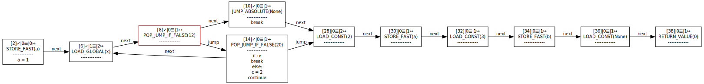

[](https://codecov.io/gh/percevalw/pygetsource)
[](https://pypi.org/project/pygetsource/)

[](https://github.com/psf/black)
[](https://opensource.org/licenses/MIT)


# pygetsource

`pygetsource` is a decompiler for Python 3, aiming to convert compiled bytecode instructions back into Python code.

## Overview

When Python reads code, it first converts the instructions into bytecode. For instance:

```python
a = 2
```

is converted into

```
LOAD_CONST 1
STORE_FAST 0
```

The latter form is typically stored in `.pyc` files and in the `__code__` attribute of function objects. The goal of `pygetsource` is to reverse this process.

The project takes its name from the `inspect.getsource` function, which returns the source code of a function, but it is not always applicable, as explained above.

`pygetsource` is still in development. It should be able to recover the source code of simple functions for various programs from Python 3.7 to Python 3.11. It is not yet able to recover the source code of classes, import statements, try/except/match/with blocks, and does not support Python 2. While functional, the codebase has not been optimized and is in need of significant refactoring.

Finally, this software is distributed under the permissive MIT license.

## Installation

Install the package using pip:

```bash
pip install pygetsource
```

## Usage

```python
import pygetsource


def func():
    a = 5

    while i < 10:
        if a == 2:
            break
        elif a == 4:
            return 3

        a = i // 5

    d = 3
    e = 4
    return e + d


print(pygetsource.getsource(func.__code__))
```

produces the following output:

```python
a = 5
while i < 10:
    if a == 2:
        break
    elif a == 4:
        return 3
    else:
        a = i // 5
d = 3
e = 4
return e + d
```

Notice how the `else` statement was added to the `elif` statement, yet the two programs are functionally equivalent.


## When is this useful ?

`pygetsource` proves useful when you need to recover the source code from a `.pyc` file, or when you want to get the source code of a function created through an eval statement or a lambda syntax. Indeed, running `inspect.getsource` fail in the latter case since the origin file of the function is either not available, or Python does not provide the exact boundaries, which are required in the case of lambda functions.

## Alternatives

[uncompyle6](https://github.com/rocky/python-uncompyle6) is a Python decompiler that supports Python 2 and 3 up to Python 3.8. It uses a grammar-based approach to rebuild code from bytecode patterns. This approach is less effective for higher versions that introduce various bytecode optimizations, especially regarding complex control structures like loops, or the example given above. At the moment, it supports a larger range of Python syntaxes (such as with blocks or try/excepts).
It is also licensed under a copyleft GPL license, making it less suitable for larger projects with permissive licenses.

[decompyle++ (pycdc)](https://github.com/zrax/pycdc) uses a state machine approach to build an AST iteratively by processing bytecode instructions. It's written in C++ and supports more Python versions than uncompyle6, but has more trouble decompiling  complex control structures like nested loops, break patterns, comprehensions, or the example given above. It also uses the copyleft GPL license.

## How does it work ?

`pygetsource` uses a distinct approach. The bytecode instructions are initially converted into a directed graph, representing the program's flow. This graph is then iteratively reduced, processing each node based on its opcode, argument, and position and generating the [AST](https://docs.python.org/3/library/ast.html) as it goes.
This method allows us to rely more on high-level patterns and less on Python’s idiosyncrasies when recreating complex structures like nested loops or break/return statements, and handle Python versions from 3.7 to 3.11 with the same codebase.

In constrast with [uncompyle6](https://github.com/rocky/python-uncompyle6) and [pycdc](https://github.com/zrax/pycdc), `pygetsource` uses the `ast` and `astunparse` libraries to generate the source code from the generated AST.

Here is an example of a graph being reduced:




## When is a decompilation successful ?

Since the compilation process is injective, it's impossible to recover the exact original source code. Multiple Python programs can yield the same bytecode instructions. Also, the original source code is typically unavailable for comparison (why would you use this software otherwise ?).

If we recompile the generated program, we can compare the two sets of bytecode instructions to ensure functional equivalence. However, Python may introduce no-op codes (like 'NOP') that might cause this verification to fail despite the two code objects being functionally equivalent.

Instead, `pygetsource` compares the graph of the original code object with the graph of the recovered code object, after a pruning step. During this step, no-op codes are removed, jump instructions are pruned (while maintaining edges between source and target nodes), and dead-code is eliminated.

## Contributing

Contributions are welcome. Feel free to open an issue or submit a pull request. Any issues related to the decompilation process should include version of the Python interpreter used to generate the bytecode, the source code of the function, and the bytecode instructions as printed by `dis.dis(code)`.

To install the project in development mode, clone the repository and run `pip install -e '.[dev]'` in the root directory. You can then run the tests using `pytest`. Make sure to have `graphviz` installed first. If you're on MacOS and have trouble with the Python `pygraphviz` package, try installing it using the following command:

```bash
pip install \
    --global-option=build_ext \
    --global-option="-I$(brew --prefix graphviz)/include/" \
    --global-option="-L$(brew --prefix graphviz)/lib/" \
    pygraphviz
```

To inspect a failure case, use the `debug=True` parameter of the `getsource` function. This will display the graph at different stages of the reduction process, as well as various debug information.
